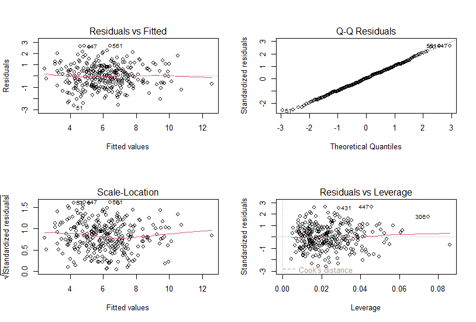
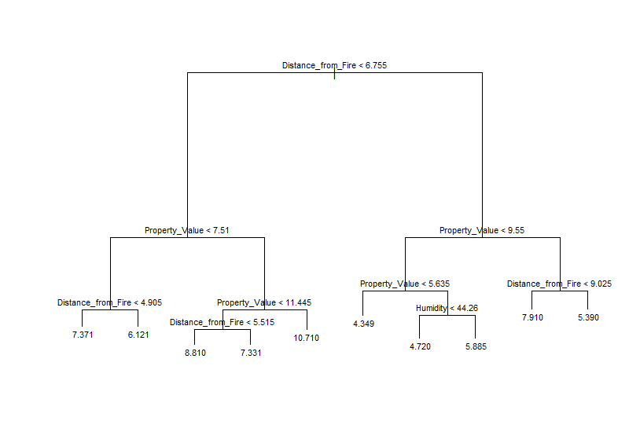
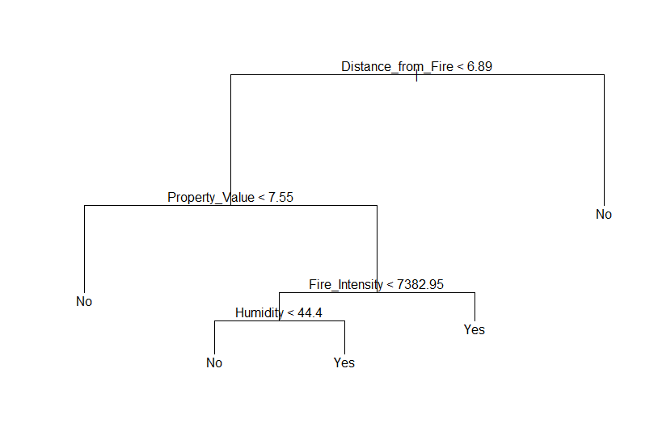
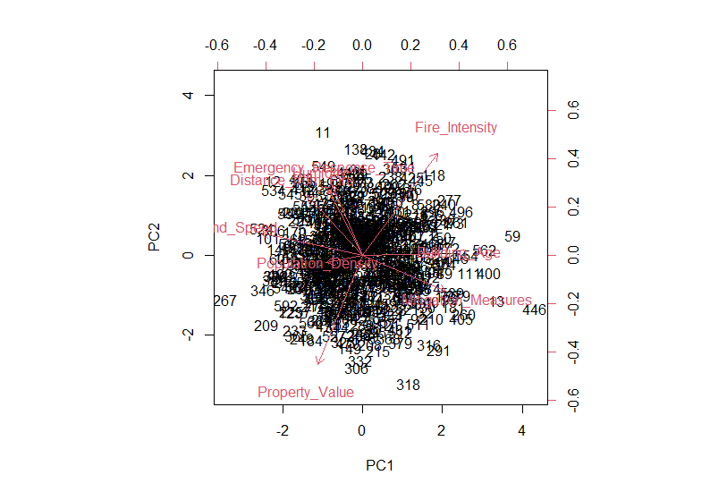

**Property damage predictions using Machine Learning**

**1. Project Overview**
This project help an insurance company to predict the amount of property damage claims resulting from bushfires to ensure they maintain sufficient financial reserves for post-disaster recovery. Accurate prediction is essential for the company to manage its financial resources effectively, fulfill client expectations, and maintain operational stability in the face of disasters.

**2. Dataset description**
Variable	Description
- Fire_Intensity          :	The intensity of the fire measured in kilowatts per metre (kW/m), representing the heat output during the fire event.
- Distance_from_Fire      :     The distance of the building from the fire's origin in kilometres (km).
- Building_Age            :	The number of years since the building was constructed.
- Property_Value          :     The estimated value of the property in hundred thousand Australian Dollars (×10⁵ AUD).
- Population_Density      :	The number of people living per square kilometre in the area where the building is located.
- Emergency_Response_Time :	The time taken for emergency services to respond, in minutes.
- Mitigation_Measures     :	The number of proactive steps taken to reduce fire risk (e.g., fireproofing materials).
- Construction_Quality    :	Categorical variable assessing building quality: "Good" or "Bad".
- Insurance_Coverage      :	Type of insurance the property owner holds: "Fully", "Partially", or "None".
- Wind_Speed              :	Average wind speed during the bushfire event in metres per second (m/s).
- Humidity                :	Average relative humidity during the bushfire, in percentage (%).
- Temperature             :	Average temperature during the bushfire event in degrees Celsius (°C).
- Damage_Claims           :	Monetary value of fire damage claims submitted, in hundred thousand AUD (×10⁵ AUD).

**3. Project workflow**
- Data understanding and pre-processing
- Exploratory Data Analysis (EDA)
- Modeling – Multiple Linear Regression
- Model Enhancement
- Modeling – Regression Tree
- Binary Classification: High Damage Claims
- Decision tree
- Model comparison
- Building Support Vector Machine Models
- Principal component Analysis
- Visualisation using biplot


**4. Model used and performance**
```r
Residuals:
     Min       1Q   Median       3Q      Max 
-2.64443 -0.66589  0.00145  0.68283  2.68320 

Coefficients:
                          Estimate Std. Error t value Pr(>|t|)    
(Intercept)              1.940e+00  4.560e-01   4.256 2.81e-05 ***
Fire_Intensity           9.092e-05  1.632e-05   5.569 5.78e-08 ***
Distance_from_Fire      -5.074e-01  3.095e-02 -16.394  < 2e-16 ***
Property_Value           5.038e-01  2.846e-02  17.701  < 2e-16 ***
Emergency_Response_Time  9.911e-02  1.478e-02   6.707 1.02e-10 ***
Mitigation_Measures      1.138e-01  3.659e-02   3.109  0.00206 ** 
Humidity                 3.159e-02  3.310e-03   9.542  < 2e-16 ***
---
Signif. codes:  0 ‘***’ 0.001 ‘**’ 0.01 ‘*’ 0.05 ‘.’ 0.1 ‘ ’ 1

Residual standard error: 1.026 on 293 degrees of freedom
Multiple R-squared:  0.7172,	Adjusted R-squared:  0.7114 
F-statistic: 123.8 on 6 and 293 DF,  p-value: < 2.2e-16
```

**5. Visual**
- Multivariate Model

- Regression Tree

- Decision tree

- Biplot


**6. Insights**
**Key Predictors of Damage Claims**
- Properties closer to the fire’s origin incur significantly higher damage claims, likely due to greater exposure to heat and flames.
- Higher-value properties result in larger claims, reflecting the increased cost of repair or replacement.
- Surprisingly, higher humidity is associated with increased claims. This counterintuitive finding may suggest confounding factors (such as humidity interacting with other variables like temperature or vegetation moisture) and warrants further investigation.
- More intense fires lead to greater damage, though its correlation with claims (0.09) is weaker than other predictors.
- Longer response times increase damage claims, as delayed intervention allows fires to cause more destruction.
- More mitigation steps are associated with higher claims in the model, which is unexpected. Typically, mitigation reduces damage, suggesting possible data anomalies or reverse causality 
- Significant variables: Fire_Intensity, Distance_from_Fire, Property_Value, Emergency_Response_Time, Mitigation_Measures, Humidity.

**Model performance
Regression model **
- Significant variables: Fire_Intensity, Distance_from_Fire, Property_Value, Emergency_Response_Time, Mitigation_Measures, Humidity.
- Adjusted R²: 0.7114 (explains 71% of variance).

**Regression Tree **
- Variables used: Distance_from_Fire, Property_Value, Humidity, Fire_Intensity, Emergency_Response_Time, Construction_Quality.
- Test MSE: 6.414 (slightly better than linear regression).


